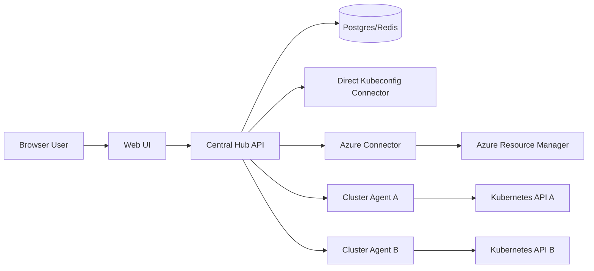

# Kubernetes Topology Viewer 기획 조사

조사 기준일: 2026-06-11

## 1. 목적

터미널 중심의 `kubectl` 운영을 보완하기 위해, 여러 Kubernetes 계열 클러스터의 리소스와 연결 관계를 웹에서 시각적으로 확인하는 관리 도구를 만든다.

핵심 목표는 다음과 같다.

- Kubernetes 표준 API를 기준으로 설계하고, 1차 지원 대상은 native/vanilla Kubernetes로 잡는다. k3s, AKS 등 Kubernetes 호환 클러스터는 후속 검증 대상으로 둔다.
- 클러스터, 노드, 네임스페이스, 파드, Deployment, StatefulSet, Service, Secret, ConfigMap, PVC/PV 등의 관계를 그래프 형태로 보여준다.
- Service가 어떤 Pod로 연결되는지, Pod가 어떤 ConfigMap/Secret/PVC를 참조하는지, Workload가 어느 노드에 배치되었는지 웹에서 추적한다.
- 단일 클러스터는 클러스터 내부에 Pod 하나를 띄우는 방식으로 바로 확인할 수 있게 한다.
- 여러 클러스터는 중앙 서버에 agent 또는 kubeconfig/Azure credential connector를 붙여 확장한다.

## 1.1 기준 플랫폼

이 제품의 기준 플랫폼은 Kubernetes다. 1차 기준은 native/vanilla Kubernetes이며, k3s, AKS, EKS, GKE, OpenShift 같은 대상은 별도 제품 기준이 아니라 Kubernetes API를 제공하는 배포판 또는 managed provider로 취급한다.

설계 우선순위:

1. Kubernetes upstream API와 리소스 모델
2. Kubernetes RBAC, ServiceAccount, list/watch, ownerReferences, label selector
3. Kubernetes 표준 리소스 graph
4. provider별 확장 정보
5. CRD/plugin 기반 확장

즉, MVP는 "native Kubernetes topology viewer"이고, k3s/AKS 지원은 MVP 이후 Kubernetes compatibility를 검증하는 형태로 진행한다.

## 2. 결론 요약

처음부터 전체 운영 플랫폼을 만들기보다, 1차는 "read-only Kubernetes topology viewer"로 시작하는 것이 현실적이다. 이후 멀티 클러스터, Azure 리소스 연결, 보안/운영 분석, 플러그인 구조를 순차적으로 추가한다.

권장 방향은 다음과 같다.

1. MVP는 단일 클러스터 in-cluster 설치를 우선한다.
2. Kubernetes API의 `list/watch`와 `client-go` informer 패턴을 사용해 리소스 상태를 캐시한다.
3. 관계 그래프는 `ownerReferences`, label selector, EndpointSlice, Pod spec reference를 기반으로 생성한다.
4. Secret은 기본적으로 metadata와 참조 관계만 보여주고 값은 절대 표시하지 않는다.
5. 멀티 클러스터는 중앙 Hub와 클러스터별 Agent 방식으로 확장한다.
6. AKS/Azure 연동은 Kubernetes 정보와 Azure Resource Manager 정보를 분리해서 붙인다.

### 2.1 현재 MVP 결정

초기 구현은 실제 Kubernetes 연결보다 UX와 데이터 모델 검증을 먼저 한다.

- 인증은 복잡한 사용자 계정 없이 `no-auth`로 시작한다.
- 외부 접근 보호는 단일 `admin token` 방식으로 둔다.
- 실제 Kubernetes API 연결 전에는 mock topology data로 모든 화면과 interaction을 먼저 만든다.
- mock 단계에서도 cluster, namespace, node, workload, pod, service, secret, configmap, pvc 관계를 실제 API 응답으로 바꾸기 쉬운 graph model로 유지한다.
- admin token은 개발 목업에서는 프론트 gate로 동작하지만, 실제 Kubernetes 연결 단계에서는 반드시 서버 API middleware에서 검증한다.
- native Kubernetes를 1차 기준으로 두고, k3s/AKS는 후속 검증 대상으로 유지한다.

## 3. 시장 및 기존 도구 조사

### 3.1 Kubernetes Dashboard

Kubernetes 공식 문서 기준으로 Kubernetes Dashboard는 deprecated 및 unmaintained 상태다. 공식 문서는 새 설치에는 Headlamp를 고려하라고 안내한다.

장점:

- 웹 기반 Kubernetes UI라는 출발점은 유사하다.
- 클러스터 리소스 개요, 애플리케이션 배포, 문제 해결, 리소스 관리를 제공한다.

한계:

- 현재 신규 제품의 기반으로 삼기 어렵다.
- 멀티 클러스터, 관계 중심 topology graph, 확장형 운영 콘솔에는 부족하다.

판단:

- 참고 대상 정도로만 보고, 기술 기반으로 채택하지 않는다.

출처: [Kubernetes Dashboard 공식 문서](https://kubernetes.io/docs/tasks/access-application-cluster/web-ui-dashboard/)

### 3.2 Headlamp

Headlamp는 Kubernetes SIG 프로젝트 계열의 웹 UI로, 클러스터 내부에 배포하거나 데스크톱 앱으로 실행할 수 있다. Helm 기반 in-cluster 설치와 RBAC 기반 인증을 제공한다. 플러그인으로 UI, 대시보드, 외부 도구 연동, resource detail 확장이 가능하다.

장점:

- Kubernetes Dashboard의 현실적 대안으로 공식 문서에서 언급된다.
- in-cluster 배포, OIDC, RBAC, ServiceAccount token 인증 모델이 이미 잡혀 있다.
- plugin 구조가 있어 확장성 참고 가치가 높다.
- Cluster Inventory 관련 기능도 제공한다.

한계:

- 기본 초점은 범용 Kubernetes UI다.
- 사용자가 원하는 "관계 그래프 중심 topology visualization"은 별도 구현이 필요할 가능성이 높다.

판단:

- 완전 신규 구현 대신 Headlamp plugin으로 시작할지 검토할 수 있다.
- 단, 제품 차별점이 topology graph라면 독립 제품이 더 자유롭다.

출처:

- [Headlamp 설치 문서](https://headlamp.dev/docs/latest/installation/)
- [Headlamp in-cluster 설치 문서](https://headlamp.dev/docs/latest/installation/in-cluster/)
- [Headlamp plugin 문서](https://headlamp.dev/docs/latest/development/plugins/)

### 3.3 Lens

Lens는 Kubernetes IDE 성격의 데스크톱 제품이다. 문서상 AKS, EKS, GKE, OpenShift cluster 추가, workload, config, network, storage, access control, events, Helm 등 매우 넓은 리소스 뷰를 제공한다.

장점:

- 멀티 클러스터 운영 UX의 참고 대상이다.
- 리소스 카테고리 구성과 detail panel 설계에 참고할 부분이 많다.
- AKS/GKE/EKS 같은 cloud integration 요구사항의 방향성을 확인할 수 있다.

한계:

- 기본적으로 데스크톱 IDE 성격이 강하다.
- 중앙 웹 서버에 배포해서 조직 내부 구성원이 접근하는 모델과는 다르다.
- topology graph 중심 제품은 별도 차별화가 가능하다.

판단:

- UX와 리소스 taxonomy 참고 대상으로 둔다.

출처: [Lens 문서](https://docs.k8slens.dev/)

### 3.4 Octant

Octant는 Kubernetes 리소스 이해를 돕는 extensible platform이었지만 GitHub repository가 2023-01-19에 archived 처리되었다.

판단:

- 아이디어 참고는 가능하지만, 신규 제품 기반으로는 부적합하다.

출처: [Octant GitHub archive](https://github.com/vmware-archive/octant)

## 4. 기술 근거

### 4.1 Kubernetes API와 watch

Kubernetes API는 HTTP 기반 RESTful resource API다. 대부분의 리소스는 `get`, `list`, `watch`로 읽을 수 있다. `watch`는 특정 `resourceVersion` 이후의 변경 이벤트를 스트림으로 받아 현재 상태와 이후 변화를 동기화하는 방식이다.

제품 설계에 주는 의미:

- 모든 리소스를 매번 polling하지 않고 `list` 후 `watch`로 캐시를 유지한다.
- Go backend에서는 `client-go` informer/cache 계층을 사용하는 것이 표준적이다.
- watch는 끊길 수 있고, 오래된 `resourceVersion`은 `410 Gone`이 날 수 있으므로 재동기화 로직이 필요하다.
- 대규모 클러스터에서는 watch 대상 리소스 수를 설정 가능하게 해야 한다.

출처: [Kubernetes API Concepts](https://kubernetes.io/docs/reference/using-api/api-concepts/)

### 4.2 관계 그래프의 핵심 데이터

Kubernetes 리소스 관계는 하나의 필드로만 완성되지 않는다. 아래 여러 근거를 조합해야 한다.

| 관계 | 근거 |
| --- | --- |
| Deployment -> ReplicaSet -> Pod | `metadata.ownerReferences` |
| StatefulSet -> Pod | `ownerReferences`, Pod name convention |
| DaemonSet -> Pod | `ownerReferences` |
| Job/CronJob -> Pod | `ownerReferences` |
| Service -> Pod | Service selector, EndpointSlice |
| Ingress -> Service | Ingress rule backend |
| Gateway/HTTPRoute -> Service | Gateway API backend reference |
| Pod -> ConfigMap | env, envFrom, volume configMap |
| Pod -> Secret | env, envFrom, volume secret, imagePullSecrets |
| Pod -> PVC -> PV -> StorageClass | volume claim, PVC spec, PV spec |
| HPA -> Deployment/StatefulSet | scaleTargetRef |
| NetworkPolicy -> Pod/Namespace | podSelector, namespaceSelector, ipBlock |
| Pod -> Node | `spec.nodeName` |

출처:

- [Owners and Dependents](https://kubernetes.io/docs/concepts/overview/working-with-objects/owners-dependents/)
- [Labels and Selectors](https://kubernetes.io/docs/concepts/overview/working-with-objects/labels/)
- [EndpointSlices](https://kubernetes.io/docs/concepts/services-networking/endpoint-slices/)
- [Gateway API](https://kubernetes.io/docs/concepts/services-networking/gateway/)
- [Network Policies](https://kubernetes.io/docs/concepts/services-networking/network-policies/)

### 4.3 EndpointSlice

EndpointSlice는 Service가 많은 backend를 효율적으로 처리하기 위한 Kubernetes API다. Kubernetes v1.21부터 stable이다. Service selector가 있는 경우 control plane이 EndpointSlice를 만들고, EndpointSlice에는 해당 Service에 매칭되는 Pod endpoint 정보가 들어간다.

제품 설계에 주는 의미:

- Service -> Pod 연결은 selector만 계산하지 말고 EndpointSlice도 함께 사용한다.
- 실제 ready endpoint와 not ready endpoint를 구분해서 보여줄 수 있다.
- selector가 없는 Service 또는 external backend도 표현 가능해야 한다.

출처: [EndpointSlices](https://kubernetes.io/docs/concepts/services-networking/endpoint-slices/)

### 4.4 CRD 확장성

Custom Resource는 Kubernetes API를 확장하는 방식이다. cluster admin은 custom resource를 동적으로 등록할 수 있고, 설치된 custom resource는 기본 리소스처럼 접근할 수 있다.

제품 설계에 주는 의미:

- 1차 MVP는 core/built-in resource 중심으로 시작한다.
- 2차부터 CRD discovery를 추가한다.
- CRD별 graph relation은 plugin 또는 rule engine으로 관리한다.
- Argo CD, cert-manager, External Secrets, Istio, Cilium, Gateway API 같은 생태계 리소스를 점진적으로 지원한다.

출처: [Custom Resources](https://kubernetes.io/docs/concepts/extend-kubernetes/api-extension/custom-resources/)

## 5. 권장 제품 아키텍처

### 5.1 전체 구조



### 5.2 컴포넌트

| 컴포넌트 | 역할 |
| --- | --- |
| Web UI | graph, table, detail panel, filter, search, timeline |
| Hub API | 사용자 인증, 권한, 클러스터 목록, graph API, audit log |
| Cluster Agent | in-cluster read-only informer, 상태 압축 전송, local health |
| Connector | kubeconfig, AKS/Azure, future EKS/GKE 연동 |
| Graph Builder | 리소스 객체를 node/edge 모델로 변환 |
| Cache Store | 최신 cluster snapshot과 graph index 저장 |
| Metrics Adapter | Metrics API, Prometheus, kube-state-metrics 연동 |

### 5.3 배포 모델

#### Mode A: 단일 클러스터 in-cluster

```text
kubectl apply 또는 helm install
-> viewer pod가 현재 클러스터 API를 read-only로 watch
-> Service/Ingress로 웹 접속
```

장점:

- 가장 빠르게 가치 검증이 가능하다.
- "아무 노드에 파드 하나만 띄우면 웹에서 확인"이라는 요구에 가장 가깝다.

한계:

- 해당 클러스터만 볼 수 있다.
- 외부 여러 클러스터를 보려면 별도 credential 또는 agent가 필요하다.

#### Mode B: 중앙 Hub + 클러스터별 Agent

```text
central server 또는 management cluster에 Hub 설치
각 cluster에 read-only agent 설치
agent가 Hub로 outbound 연결
```

장점:

- private cluster, 방화벽 환경에 유리하다.
- kubeconfig를 중앙에 많이 저장하지 않아도 된다.
- 클러스터별 권한과 네트워크 경계를 분리하기 쉽다.

한계:

- agent 배포와 upgrade 관리가 필요하다.

#### Mode C: 중앙 Hub + kubeconfig direct

```text
Hub에 kubeconfig 또는 API endpoint/token 등록
Hub가 직접 Kubernetes API list/watch
```

장점:

- agent 설치 없이 빠르게 멀티 클러스터 등록 가능하다.

한계:

- Hub가 각 API server에 네트워크 접근 가능해야 한다.
- credential 보관 리스크가 크다.

#### Mode D: Docker standalone + Azure credential

```text
특정 서버에 Docker image 실행
Azure credential 또는 managed identity로 AKS 목록 조회
선택한 cluster credential 획득 또는 agent 설치 유도
```

장점:

- 사용자가 말한 "특정 서버에 도커 이미지로 띄우고 Azure credential을 넣어서 본다"는 모델에 부합한다.

한계:

- AKS control plane 접근 권한과 Azure RBAC가 필요하다.
- long-lived secret 저장을 피해야 한다.

## 6. 데이터 모델

### 6.1 Graph node

```json
{
  "id": "cluster-a:default:Pod:nginx-123",
  "clusterId": "cluster-a",
  "apiVersion": "v1",
  "kind": "Pod",
  "namespace": "default",
  "name": "nginx-123",
  "uid": "....",
  "status": "Running",
  "labels": {
    "app": "nginx"
  },
  "summary": {
    "nodeName": "worker-1",
    "restarts": 0,
    "ready": true
  }
}
```

### 6.2 Graph edge

```json
{
  "id": "edge-service-nginx-to-pod-nginx-123",
  "clusterId": "cluster-a",
  "source": "cluster-a:default:Service:nginx",
  "target": "cluster-a:default:Pod:nginx-123",
  "type": "service-endpoint",
  "confidence": "observed",
  "sourceField": "EndpointSlice.endpoints.targetRef"
}
```

### 6.3 Edge type

| Edge type | 의미 |
| --- | --- |
| `owns` | ownerReferences 기반 소유 관계 |
| `selects` | label selector 기반 선택 관계 |
| `service-endpoint` | EndpointSlice 기반 Service backend |
| `routes-to` | Ingress/Gateway/Route가 Service로 라우팅 |
| `mounts` | Pod가 Secret/ConfigMap/PVC를 volume으로 사용 |
| `env-from` | Pod가 Secret/ConfigMap을 env/envFrom으로 사용 |
| `scheduled-on` | Pod가 Node에 스케줄됨 |
| `targets-scale` | HPA가 workload를 스케일링 |
| `allows-traffic` | NetworkPolicy가 통신을 허용 |
| `binds-role` | RoleBinding/ClusterRoleBinding 권한 관계 |

## 7. 화면 기획

### 7.1 Global Overview

표시 항목:

- 클러스터 목록
- 클러스터별 Kubernetes version, provider, region
- Ready/NotReady node 수
- Running/Pending/Failed/CrashLoopBackOff pod 수
- Warning event 수
- namespace별 workload 수
- 최근 배포/스케일/장애 이벤트

### 7.2 Topology Map

중심 기능:

- graph 기반 리소스 시각화
- namespace, node, service, workload 중심 보기 전환
- zoom, pan, fit, search, filter
- 리소스 종류별 icon
- 상태별 색상
- edge type별 선 스타일

색상 모드:

- 상태: healthy, warning, error, unknown
- namespace
- cluster
- node
- app label
- team/owner label
- risk level

### 7.2.1 Traffic Flow View

Topology Map이 리소스 전체 관계를 보여주는 화면이라면, Traffic Flow View는 `kubectl get ... -o yaml`로 확인 가능한 spec/status 정보를 근거로 실제 요청 흐름에 가까운 순서도를 보여준다.

목표 표현:

```text
External Client -> Ingress/Gateway -> Service -> EndpointSlice -> Pod -> Node
Internal Client -> Service DNS -> Service -> EndpointSlice -> Pod -> Node
Pod -> ConfigMap/Secret/PVC
```

근거 필드:

| 흐름 | YAML 근거 |
| --- | --- |
| Ingress -> Service | `Ingress.spec.rules[].http.paths[].backend.service` |
| Gateway/HTTPRoute -> Service | `HTTPRoute.spec.rules[].backendRefs` |
| Service -> Pod | `Service.spec.selector`, `EndpointSlice.metadata.labels.kubernetes.io/service-name`, `EndpointSlice.endpoints[].targetRef` |
| Pod -> Node | `Pod.spec.nodeName` |
| Pod -> ConfigMap | `Pod.spec.containers[].envFrom.configMapRef`, `env[].valueFrom.configMapKeyRef`, `volumes[].configMap` |
| Pod -> Secret | `Pod.spec.containers[].envFrom.secretRef`, `env[].valueFrom.secretKeyRef`, `volumes[].secret`, `imagePullSecrets` |
| Pod -> PVC | `Pod.spec.volumes[].persistentVolumeClaim.claimName` |
| NetworkPolicy 영향 | `NetworkPolicy.spec.podSelector`, `ingress`, `egress` |

화면 정책:

- 리소스 전체 관계가 아니라 트래픽 경로 중심으로 정렬한다.
- `declared` 관계와 `observed` 관계를 구분한다. 예를 들어 Service selector는 declared이고 EndpointSlice targetRef는 observed에 가깝다.
- Endpoint가 없거나 ready endpoint가 부족한 Service는 흐름 중간에서 warning으로 표시한다.
- Secret value는 표시하지 않고 Secret 이름/type/key count/reference만 표시한다.
- 첫 구현은 `routes-to`, `service-endpoint`, `scheduled-on`, `env-from`, `mounts`, `binds-storage` edge를 조합해 Flow를 만든다.

### 7.3 Namespace View

표시 항목:

- namespace 안의 workload, service, config, secret, storage
- namespace quota, limit range
- namespace label, annotation
- 해당 namespace에 영향을 주는 NetworkPolicy와 RBAC

### 7.4 Node View

표시 항목:

- node condition
- taint/toleration
- capacity/allocatable
- node에 올라간 pod
- daemonset pod
- node pressure 상태
- 특정 node 장애 시 영향받는 workload

### 7.5 Service View

표시 항목:

- Ingress/Gateway -> Service -> EndpointSlice -> Pod
- ClusterIP, NodePort, LoadBalancer IP
- externalTrafficPolicy, internalTrafficPolicy
- ready endpoint와 not ready endpoint
- selector mismatch 경고
- endpoint가 없는 service 경고

### 7.6 Resource Detail Panel

탭 구성:

- Summary
- Relationships
- YAML
- Events
- Logs
- Metrics
- Security

Secret 정책:

- 기본적으로 Secret value는 표시하지 않는다.
- `get secrets` 권한이 있어도 UI 기본값은 metadata only다.
- 필요 시 별도 admin 설정과 audit log를 요구한다.

## 8. 보안 설계

### 8.0 MVP 접근 모델: no-auth + admin token

초기 MVP는 사용자/조직/권한 관리 기능을 만들지 않는다. 대신 단일 admin token으로 UI와 API 접근을 보호한다.

동작 방식:

- 사용자는 웹 진입 시 admin token을 입력한다.
- 브라우저는 token을 localStorage에 저장하고 이후 API 요청에 `Authorization: Bearer <token>`을 붙인다.
- backend는 환경변수 `KUVIEWER_ADMIN_TOKEN`과 요청 token을 비교한다.
- token이 없거나 틀리면 Kubernetes snapshot/graph API를 반환하지 않는다.

주의사항:

- 프론트엔드만 있는 mock 단계의 token gate는 UX 확인용이며 강한 보안 경계가 아니다.
- 실제 Kubernetes API 연결부터는 server-side token 검증을 필수로 한다.
- admin token은 코드에 하드코딩하지 않고 `.env` 또는 Kubernetes Secret으로 주입한다.
- public internet에 노출하는 운영 구성은 MVP 범위가 아니며, reverse proxy allowlist/VPN/OIDC 같은 추가 보호를 검토한다.

### 8.1 Kubernetes RBAC

Kubernetes RBAC는 Role, ClusterRole, RoleBinding, ClusterRoleBinding으로 권한을 구성한다. 권한은 additive model이며 deny rule이 없다. ClusterRole은 cluster-scoped resource와 전체 namespace 대상 리소스 접근에 사용된다.

MVP 권한 원칙:

- read-only 전용 ServiceAccount 생성
- 기본 verbs는 `get`, `list`, `watch`
- write 기능은 MVP에서 제외
- Secret은 가능하면 list/watch하지 않고 metadata만 가져오는 별도 전략 검토
- logs 조회는 `pods/log` subresource 권한을 별도로 둔다

출처: [Kubernetes RBAC 문서](https://kubernetes.io/docs/reference/access-authn-authz/rbac/)

### 8.2 ServiceAccount

ServiceAccount는 Kubernetes 내부의 non-human identity다. Pod, system component, 외부 entity가 API server에 인증할 때 사용할 수 있다.

제품 설계에 주는 의미:

- in-cluster agent는 전용 ServiceAccount를 사용한다.
- namespace별 제한 모드와 cluster-wide read-only 모드를 나눠 제공한다.
- default ServiceAccount에 권한을 부여하지 않는다.

출처: [Service Accounts](https://kubernetes.io/docs/concepts/security/service-accounts/)

### 8.3 Secret 취급

Kubernetes Secret은 민감 정보를 저장하며 base64로 encoding된다. 공식 문서는 Secret의 list access가 Secret 내용을 가져올 수 있음을 경고한다.

제품 정책:

- Secret value는 저장하지 않는다.
- Secret reference 관계만 graph에 표현한다.
- Secret 상세 화면은 name, namespace, type, key count, age, owner/reference만 표시한다.
- value reveal 기능은 기본 비활성화한다.
- reveal이 필요한 경우 별도 RBAC, break-glass, audit log, masking을 요구한다.

출처: [Good practices for Kubernetes Secrets](https://kubernetes.io/docs/concepts/security/secrets-good-practices/)

## 9. Azure/AKS 확장 설계

### 9.1 Kubernetes layer와 Azure layer 분리

AKS는 Kubernetes API를 제공하므로 기본 topology 기능은 다른 Kubernetes 클러스터와 동일하게 처리한다. Azure 고유 정보는 별도 connector에서 가져온다.

Kubernetes layer:

- Node, Pod, Workload, Service, EndpointSlice, Ingress, Secret, ConfigMap
- Kubernetes RBAC 기준

Azure layer:

- Subscription
- Resource Group
- AKS cluster
- Node pool
- VMSS
- Load Balancer
- Public IP
- NSG
- Managed Identity
- Azure tags

Azure Resource Manager는 Azure 리소스의 deployment/management layer이며, API/CLI/SDK 요청을 인증 및 인가한 뒤 각 서비스로 전달한다. Resource group, subscription, tags, access control을 조직화 기준으로 사용할 수 있다.

출처: [Azure Resource Manager 개요](https://learn.microsoft.com/en-us/azure/azure-resource-manager/management/overview)

### 9.2 AKS Workload Identity

AKS에서 Pod가 Azure 리소스에 접근할 때는 Microsoft Entra Workload ID를 우선 고려한다. Workload ID는 Kubernetes service account token projection과 OIDC federation을 사용해 annotated service account 기반으로 Azure 리소스에 접근하게 한다. Microsoft 문서 기준 AKS 1.22 이상을 요구한다.

제품 설계에 주는 의미:

- AKS 내부에 Hub 또는 Agent를 배포하는 경우 static Azure secret보다 Workload Identity를 우선한다.
- Docker standalone 모드는 managed identity, workload identity, service principal 순서로 인증 옵션을 제공한다.
- long-lived credential은 암호화 저장과 rotation 전략이 필요하다.

출처: [AKS Workload Identity](https://learn.microsoft.com/en-us/azure/aks/workload-identity-overview)

## 10. Metrics와 Observability

### 10.1 Kubernetes Metrics API

Metrics API는 node와 pod의 CPU/memory 같은 기본 리소스 사용량을 제공한다. HPA/VPA가 이 데이터를 사용한다. 더 완전한 metric이 필요하면 custom metrics pipeline 또는 Prometheus 같은 별도 pipeline이 필요하다.

출처: [Resource metrics pipeline](https://kubernetes.io/docs/tasks/debug/debug-cluster/resource-metrics-pipeline/)

### 10.2 kube-state-metrics

kube-state-metrics는 Kubernetes API server를 listen하고 object state metric을 생성한다. Deployment, Node, Pod 같은 객체 상태를 metric으로 노출하며, Kubernetes object state를 기반으로 한다.

제품 설계에 주는 의미:

- topology graph의 최신 상태는 Kubernetes watch 기반이 우선이다.
- object state trend와 alert 연계는 kube-state-metrics/Prometheus를 붙이는 방식이 좋다.
- Metrics Server와 kube-state-metrics는 목적이 다르므로 둘 다 선택적으로 지원한다.

출처: [kube-state-metrics GitHub](https://github.com/kubernetes/kube-state-metrics)

### 10.3 Prometheus

Kubernetes system component metric은 Prometheus format으로 노출된다. 운영 대시보드와 alert를 강화하려면 Prometheus datasource 연동이 자연스럽다.

출처: [Kubernetes system metrics](https://kubernetes.io/docs/concepts/cluster-administration/system-metrics/)

## 11. MVP 범위

### 11.1 MVP 목표

최종 MVP는 단일 클러스터에 Helm chart로 설치하면 웹에서 리소스 관계를 확인할 수 있게 한다. 단, 구현 순서는 mock UI를 먼저 완성한 뒤 실제 Kubernetes connector를 붙인다.

Phase 0 목표:

- Tailwind CSS 기반 웹 UI
- no-auth/admin-token gate
- mock Kubernetes topology graph
- cluster/namespace/node/resource 필터
- resource detail panel
- 관계 edge 표시와 상태 색상
- 실제 API로 교체 가능한 TypeScript graph model

필수 기능:

- in-cluster 설치
- read-only ServiceAccount/RBAC
- namespace/node/workload/service/pod 중심 graph
- 리소스 목록과 상세 패널
- 상태별 색상
- 검색과 필터
- YAML read-only 보기
- event 보기

지원 리소스:

- Namespace
- Node
- Pod
- Deployment
- ReplicaSet
- StatefulSet
- DaemonSet
- Job
- CronJob
- Service
- EndpointSlice
- Ingress
- ConfigMap
- Secret metadata
- PVC
- PV
- StorageClass
- HPA
- Event

우선 관계:

- Workload -> Pod
- Service -> EndpointSlice -> Pod
- Ingress -> Service
- Pod -> Node
- Pod -> ConfigMap
- Pod -> Secret
- Pod -> PVC -> PV
- HPA -> Workload

### 11.1.1 Phase 0 Mock Data 원칙

목업 데이터는 단순 화면 장식이 아니라 실제 connector의 contract 초안으로 사용한다.

- `TopologyNode`, `TopologyEdge`, `ClusterSummary` 타입을 먼저 고정한다.
- UI는 mock provider를 통해 데이터를 읽고, 이후 API provider로 교체한다.
- resource id는 `cluster:namespace:kind:name` 형태를 기본으로 한다.
- Secret은 mock에서도 metadata와 참조 관계만 표현한다.
- color mode는 `status`, `namespace`, `cluster`, `node`, `kind` 기준을 먼저 지원한다.
- 연결 관계는 `owns`, `selects`, `service-endpoint`, `routes-to`, `mounts`, `env-from`, `scheduled-on`부터 시작한다.

### 11.1.2 Phase 0 API Contract

프론트엔드는 기본적으로 내장 mock data를 사용하지만, `VITE_API_BASE_URL`이 있으면 서버의 `GET /api/topology` 응답을 사용한다.

서버 기본값:

- `KUVIEWER_LISTEN_ADDR=127.0.0.1:8080`
- `KUVIEWER_ADMIN_TOKEN=kuviewer-admin`
- `KUVIEWER_CORS_ORIGIN=http://127.0.0.1:5174`
- `KUVIEWER_SOURCE=mock`

API:

- `GET /healthz`: 인증 없는 health check
- `GET /api/topology`: `Authorization: Bearer <admin-token>` 필수

provider 전략:

- `mock`: 현재 동작하는 기본 provider
- `kubernetes`: Kubernetes REST API를 읽어 snapshot을 만드는 1차 provider. in-cluster ServiceAccount 또는 외부 API server + bearer token 환경변수로 동작한다.

이 구조 덕분에 프론트 UI는 유지한 채 server provider만 mock에서 Kubernetes API로 교체할 수 있다.

현재 Kubernetes provider 범위:

- list 기반 snapshot 전용이며 watch/informer는 후속 단계다.
- Namespace, Node, Pod, Service, EndpointSlice, Deployment, ReplicaSet, StatefulSet, DaemonSet, Ingress, PVC를 읽는다.
- Secret은 list하지 않고 Pod reference에서 metadata 노드만 생성한다.
- ConfigMap도 우선 Pod reference 기반 metadata 노드로 생성한다.
- Service -> Pod는 EndpointSlice `targetRef`를 우선하고, 없으면 Service selector 기반 inferred edge를 만든다.
- Pod -> ConfigMap/Secret/PVC는 `envFrom`, `env.valueFrom`, `volumes`, `imagePullSecrets`를 근거로 만든다.

단일 Pod 배포 방향:

- Go 서버가 `/api/*`와 React 정적 build 결과를 같은 프로세스에서 서빙한다.
- root `Dockerfile`은 frontend build와 server build를 묶어 단일 image를 만든다.
- `deploy/kubernetes/kuviewer.yaml`은 Namespace, Secret, ServiceAccount, ClusterRole, ClusterRoleBinding, Deployment, Service를 포함한다.
- RBAC는 `secrets` read 권한을 부여하지 않는다.
- 초기 접속은 `kubectl -n kuviewer port-forward svc/kuviewer 8080:8080`를 기준으로 둔다.

### 11.2 MVP 제외

- 리소스 생성/수정/삭제
- Secret value 표시
- exec shell
- port-forward
- full cloud inventory
- multi-tenant billing
- AI 분석
- service mesh traffic graph

## 12. 2차/3차 확장

### 12.1 2차: 멀티 클러스터

- 중앙 Hub
- 클러스터별 Agent
- cluster registration token
- agent heartbeat
- cluster health
- cluster group/tag
- global search
- graph cross-cluster filter

### 12.2 3차: Azure/AKS

- Azure login/credential connector
- subscription/resource group/AKS 목록
- AKS cluster import
- node pool, VMSS, LB, Public IP 연결
- Azure tag 기반 색상 모드
- Workload Identity 기반 Azure API 접근

### 12.3 4차: 확장 생태계

- CRD discovery
- plugin SDK
- relation rule DSL
- Argo CD Application -> Kubernetes resource 연결
- ExternalSecret -> Secret 연결
- cert-manager Certificate -> Secret/Ingress 연결
- Istio VirtualService/Gateway 연결
- Cilium/Hubble traffic view

## 13. 무료 기반 추천 기술 스택

요구사항에 따라 웹 디자인은 Tailwind CSS를 고정한다. 나머지 스택은 "상용 서비스 결제 없이 사용 가능", "native Kubernetes 우선", "Kubernetes 표준 API 호환", "MacBook 로컬 개발 가능", "운영 배포 가능"을 기준으로 선택한다.

### 13.1 무료 기술 스택 원칙

여기서 "무료"는 이 제품 기획에 포함되는 기술 스택의 사용 조건을 의미한다. 즉, 언어, framework, library, database, build tool, packaging tool, local development runtime이 무료로 사용 가능해야 한다. 클러스터를 올릴 서버, VM, 클라우드 리소스, 네트워크 비용까지 0원이어야 한다는 뜻은 아니다.

선정 기준:

- MVP 기본 스택에는 유료 SaaS 또는 유료 플랜이 필요한 component를 넣지 않는다.
- 상용/조직 사용에서 비용 조건이 붙을 수 있는 tool은 기본 스택에서 제외하거나 optional로만 둔다.
- AGPL/SSPL/Commons Clause/Elastic License/Business Source License처럼 배포와 상용화 해석이 까다로운 라이선스는 MVP 기본 스택에서 제외한다.
- MIT, Apache-2.0, BSD, ISC, PostgreSQL License, Public Domain 계열을 우선한다.
- Docker Desktop은 개인/소규모/교육/비상업 오픈소스에는 무료지만, 큰 조직의 professional use 또는 free tier 초과 상업 사용은 유료 구독이 필요하다. 따라서 이 기획의 기본 기술 스택에는 포함하지 않는다.
- MacBook 로컬 개발은 Colima/Lima 기반 container runtime과 k3d 또는 k3s를 우선한다.

출처:

- [Docker Desktop license agreement](https://docs.docker.com/subscription/desktop-license/)
- [Colima License](https://github.com/abiosoft/colima/blob/main/LICENSE)
- [Lima License](https://github.com/lima-vm/lima/blob/master/LICENSE)

### 13.2 Frontend

권장 스택:

| 영역 | 선택 | 라이선스/비용 | 판단 |
| --- | --- | --- | --- |
| Framework | React + Vite + TypeScript | Vite MIT, React는 오픈소스 | 빠른 개발, 생태계, 배포 단순성 |
| Styling | Tailwind CSS | MIT | 사용자 요구사항. utility 기반으로 운영 UI 구현에 적합 |
| UI Primitive | Radix UI + shadcn/ui | shadcn/ui MIT | 접근성 좋은 컴포넌트 기반, Tailwind와 궁합 좋음 |
| Icon | Lucide React | ISC/MIT 계열 | Kubernetes 리소스 아이콘/툴바에 적합 |
| Server state | TanStack Query | MIT | cluster/resource API 캐시와 refetch 제어에 적합 |
| Client state | Zustand | MIT | graph filter, selected resource, panel state 관리에 충분 |
| YAML viewer | Monaco Editor 또는 CodeMirror | 오픈소스 | read-only YAML/JSON 보기 |
| Graph MVP | React Flow | MIT | 커스텀 노드와 panel UI 결합이 빠름 |
| Graph 대규모 옵션 | Cytoscape.js | MIT 계열 | 대형 graph와 layout 성능이 중요해지면 검토 |

MVP 판단:

- 1차 구현은 React Flow가 맞다. Kubernetes resource node를 Tailwind component로 직접 디자인하기 쉽고, 클릭/선택/패널 연동이 빠르다.
- 5,000개 이상의 node/edge를 한 화면에 직접 렌더링해야 하는 요구가 강해지면 Cytoscape.js로 graph canvas만 교체할 수 있게 graph data model을 라이브러리 중립적으로 둔다.

출처:

- [Tailwind CSS License](https://github.com/tailwindlabs/tailwindcss/blob/main/LICENSE)
- [React Flow/xyflow License](https://github.com/xyflow/xyflow/blob/main/LICENSE)
- [Cytoscape.js License](https://github.com/cytoscape/cytoscape.js/blob/master/LICENSE)
- [shadcn/ui License](https://github.com/shadcn-ui/ui/blob/main/LICENSE.md)
- [Vite License](https://github.com/vitejs/vite/blob/main/LICENSE)
- [TanStack Query License](https://github.com/TanStack/query/blob/main/LICENSE)
- [Zustand License](https://github.com/pmndrs/zustand/blob/main/LICENSE)
- [Lucide License](https://github.com/lucide-icons/lucide/blob/main/LICENSE)

### 13.3 Backend

권장 스택:

| 영역 | 선택 | 라이선스/비용 | 판단 |
| --- | --- | --- | --- |
| Language | Go | BSD-style | Kubernetes 생태계와 가장 잘 맞음 |
| Kubernetes client | `k8s.io/client-go` | Apache-2.0 | informer/watch 구현 표준 |
| API router | `go-chi/chi` 또는 Go `net/http` | chi MIT, stdlib 무료 | 가볍고 단순함 |
| Realtime | Server-Sent Events 우선, 필요 시 WebSocket | 추가 비용 없음 | graph update stream에 충분 |
| Auth MVP | local admin token 또는 OIDC optional | 자체 구현/오픈소스 | MVP는 단순하게 시작 |
| Config | env + YAML | 무료 | Helm values와 잘 맞음 |
| Logging | `slog` | Go stdlib | 추가 의존성 최소화 |

Go를 추천하는 이유:

- Kubernetes official/client ecosystem이 Go 중심이다.
- informer cache, workqueue, dynamic client, discovery client를 자연스럽게 쓸 수 있다.
- agent를 단일 binary로 만들기 쉽다.
- k3s 같은 작은 환경에도 배포 부담이 낮다.

출처:

- [Go License](https://go.dev/LICENSE)
- [Kubernetes client-go License](https://github.com/kubernetes/client-go/blob/master/LICENSE)
- [go-chi License](https://github.com/go-chi/chi/blob/master/LICENSE)

### 13.4 Storage

MVP:

- 기본은 in-memory cache다.
- 단일 클러스터 viewer는 재시작 시 Kubernetes API에서 다시 list/watch 하면 되므로 DB가 없어도 된다.
- 설정 저장이 필요하면 SQLite를 optional로 둔다. SQLite는 public domain이다.

멀티 클러스터:

- Postgres를 기본 영속 저장소로 둔다.
- Redis는 라이선스 이슈를 피하기 위해 기본값에서 제외한다.
- realtime fanout/cache가 필요해지면 Valkey 또는 in-process cache부터 검토한다.

저장 데이터:

- cluster metadata
- resource snapshot checksum
- graph layout cache
- user/session
- audit log
- connector config metadata

저장하지 않을 데이터:

- Secret value
- kubeconfig raw content를 평문으로 저장하지 않는다.
- Azure credential raw secret을 평문으로 저장하지 않는다.

출처:

- [SQLite Copyright](https://sqlite.org/copyright.html)
- [PostgreSQL License](https://www.postgresql.org/about/licence/)

### 13.5 배포/패키징

권장:

- Helm chart
- plain Kubernetes manifests
- Docker/OCI image
- kustomize overlay optional

무료 조건:

- Helm은 Apache-2.0 라이선스다.
- k3s는 Apache-2.0 기반의 lightweight Kubernetes 배포판이다.
- k3s는 단일 binary, 기본 SQLite datastore, Traefik, ServiceLB, local-path-provisioner 등을 포함하므로 작은 서버/노드 환경 테스트에 적합하다.

출처:

- [Helm License](https://github.com/helm/helm/blob/main/LICENSE)
- [K3s 공식 문서](https://docs.k3s.io/)
- [K3s License](https://github.com/k3s-io/k3s/blob/main/LICENSE)

### 13.6 MacBook 로컬 개발 환경

전제:

- Mac 기본 shell은 보통 zsh다.
- 로컬 개발 스크립트는 `zsh`와 `bash` 모두에서 돌아가게 POSIX에 가깝게 작성한다.
- 이 프로젝트의 개발 문서에는 zsh 기준 명령을 먼저 적는다.

권장 무료 로컬 조합:

| 목적 | 선택 |
| --- | --- |
| Package manager | Homebrew |
| Container runtime | Colima + containerd 또는 Docker-compatible mode |
| Local Kubernetes | k3d 또는 k3s |
| Kubernetes CLI | kubectl |
| Helm | helm |
| Frontend runtime | Node.js LTS + pnpm |
| Backend runtime | Go |

Docker Desktop 회피 이유:

- Docker Desktop 자체는 무료 범위가 있지만, 큰 조직/정부/상업 사용 조건에서 유료 구독이 필요할 수 있다.
- "무조건 무료" 조건을 만족하려면 Colima/Lima/containerd/k3d 조합이 더 안전하다.

권장 로컬 실행 흐름:

```zsh
# 1. 무료 container runtime
brew install colima docker kubectl helm k3d go node pnpm
colima start --cpu 4 --memory 8

# 2. k3s 기반 local cluster
k3d cluster create kuviewer-dev --agents 2

# 3. backend/frontend 개발
pnpm install
pnpm dev
go run ./cmd/server

# 4. Helm 설치 테스트
helm install kuviewer ./charts/kuviewer --namespace kuviewer --create-namespace
```

실제 repository 구조가 정해지면 위 명령은 `Makefile` 또는 `scripts/dev.zsh`로 고정한다.

### 13.7 최종 추천 스택

MVP 최종안:

```text
Frontend:
  React + TypeScript + Vite
  Tailwind CSS
  shadcn/ui + Radix UI
  Lucide React
  React Flow
  TanStack Query
  Zustand

Backend/Agent:
  Go
  client-go informer/watch
  net/http 또는 go-chi
  Server-Sent Events
  in-memory cache

Deploy:
  Helm chart
  plain manifests
  OCI image

Local free dev:
  macOS zsh
  Homebrew
  Colima/Lima
  k3d 또는 k3s
  kubectl/helm

Optional later:
  PostgreSQL
  Valkey
  Cytoscape.js for larger graph
  Prometheus/kube-state-metrics integration
```

### 13.8 무료 전용 진행 방식

이 프로젝트는 기본 경로에서 유료 제품, 유료 SaaS, 상용 제한 도구를 사용하지 않는다. 사용자가 별도 선택한 cloud VM, physical server, managed Kubernetes 비용은 프로젝트 외부 인프라 비용으로 본다. 제품 자체를 만들고 배포하는 데 필요한 기술 스택은 무료 사용 가능한 오픈소스 기반으로 고정한다.

기본 무료 경로:

| 영역 | 무료 기본값 | 제외/주의 |
| --- | --- | --- |
| Local container runtime | Colima/Lima | Docker Desktop은 조직 규모와 상업 사용 조건에 따라 유료 가능성이 있어 기본값 제외 |
| Local Kubernetes | kind 또는 kubeadm 기반 local cluster | Docker Desktop Kubernetes 제외 |
| Production Kubernetes | kubeadm Kubernetes, self-managed native Kubernetes | 유료 managed feature에 의존하지 않음 |
| Frontend | React/Vite/Tailwind | 유료 UI kit 제외 |
| Backend | Go/client-go | 유료 backend platform 제외 |
| Storage MVP | in-memory, SQLite | 유료 DB SaaS 제외 |
| Storage 확장 | PostgreSQL self-hosted | managed DB는 optional이며 기본값 아님 |
| Observability | optional Prometheus/kube-state-metrics self-hosted | Datadog/New Relic/Grafana Cloud 같은 유료 SaaS 기본 제외 |
| Deployment | Helm chart, plain manifests | 유료 배포 플랫폼 의존 없음 |
| Registry | self-hosted registry 또는 사용자가 선택한 OCI registry | 특정 유료 registry 강제 없음 |

금지 기본 의존성:

- Docker Desktop
- Lens Pro/Teamwork 같은 유료 기능
- Grafana Cloud, Datadog, New Relic 등 SaaS observability
- Redis Ltd. 라이선스 계열 기능 또는 Redis Enterprise
- Elastic License/SSPL/Commons Clause/Business Source License 기반 component
- 유료 graph library, 유료 icon pack, 유료 admin template

허용 조건:

- 사용자가 이미 보유한 AKS/EKS/GKE/k3s 같은 Kubernetes 호환 cluster를 연결하는 것은 후속 단계에서 가능하다.
- 단, 제품 구현 자체는 해당 cloud의 유료 부가 기능에 의존하지 않는다.
- Azure connector는 optional plugin으로 둔다. Kubernetes topology viewer core는 cloud credential 없이도 동작해야 한다.

### 13.9 native Kubernetes 우선 지원 방침

MVP는 native/vanilla Kubernetes를 1차 지원 대상으로 둔다. 여기서 native Kubernetes는 kubeadm 등으로 구성된 upstream Kubernetes에 가까운 환경을 의미한다. 제품 core는 Kubernetes 표준 API와 RBAC/list/watch/ownerReferences/label selector만 사용해야 한다.

native Kubernetes 지원 요구사항:

- Helm chart가 kubeadm 기반 Kubernetes에 그대로 설치되어야 한다.
- `ClusterIP`, `NodePort`, `Ingress` 중 하나로 웹 접근이 가능해야 한다.
- cloud-provider 전용 field나 managed Kubernetes 전용 API에 의존하지 않아야 한다.
- container runtime은 Docker가 아니라 containerd 기준으로도 정상 동작해야 한다.
- optional storage 없이 in-memory mode로 실행 가능해야 한다.
- PVC를 쓸 경우 StorageClass가 없는 환경에서도 storage disabled mode로 동작해야 한다.
- Kubernetes API 표준 리소스만으로 graph를 구성해야 한다.

MVP 테스트 매트릭스:

| 시나리오 | 목표 |
| --- | --- |
| kind local cluster | MacBook 개발 환경에서 빠른 반복 테스트 |
| kubeadm single-control-plane cluster | native Kubernetes 설치 호환성 확인 |
| multi-node Kubernetes | Node -> Pod 배치 graph 확인 |
| Kubernetes + Ingress controller | 웹 접근 방식 검증 |
| Kubernetes without default StorageClass | storage optional 동작 확인 |

### 13.10 후속 k3s 지원 방침

k3s는 MVP 이후 검증 대상이다. k3s는 Kubernetes compatible 배포판이므로 core 설계를 Kubernetes 표준 API 중심으로 유지하면 후속 지원 가능성이 높다. 다만 k3s는 Traefik, ServiceLB, local-path-provisioner 등 기본 구성 차이가 있으므로 별도 테스트 매트릭스로 분리한다.

후속 k3s 검증 항목:

- single-node k3s
- multi-node k3s
- k3s 기본 Traefik Ingress
- k3s ServiceLB
- k3s local-path-provisioner
- k3s containerd runtime

참고:

- [K3s 공식 문서](https://docs.k3s.io/)
- [Docker Desktop license agreement](https://docs.docker.com/subscription/desktop-license/)
- [Colima License](https://github.com/abiosoft/colima/blob/main/LICENSE)
- [k3d License](https://github.com/k3d-io/k3d/blob/main/LICENSE)

## 14. 성능 설계

대규모 클러스터에서 graph UI가 무거워질 수 있으므로 처음부터 제한을 둔다.

원칙:

- 전체 graph를 한 번에 그리지 않는다.
- cluster -> namespace -> workload 순으로 progressive loading한다.
- node/edge pagination 또는 viewport query를 둔다.
- namespace, kind, label, status filter를 서버에서 적용한다.
- watch event는 debounce/batch 처리한다.
- graph layout 결과를 cache한다.
- high-cardinality 리소스는 기본 숨김 옵션을 둔다.

대상 예시:

- MVP: 1 cluster, 100 nodes, 5,000 pods까지 실사용 가능
- 2차: 10 clusters, 50,000 pods를 namespace 단위 drill-down으로 지원
- 3차: 100 clusters 이상은 fleet summary와 on-demand detail 중심으로 전환

## 15. API 예시

```http
GET /api/clusters
GET /api/clusters/{clusterId}/summary
GET /api/clusters/{clusterId}/graph?namespace=default&view=service
GET /api/clusters/{clusterId}/resources/{kind}/{namespace}/{name}
GET /api/clusters/{clusterId}/resources/{kind}/{namespace}/{name}/events
GET /api/clusters/{clusterId}/resources/{kind}/{namespace}/{name}/yaml
GET /api/clusters/{clusterId}/search?q=nginx
GET /api/clusters/{clusterId}/metrics/pod/{namespace}/{name}
WS  /api/watch
```

## 16. RBAC 예시

MVP용 read-only ClusterRole 예시다. 실제 구현에서는 Secret 권한을 더 보수적으로 나누는 것을 권장한다.

```yaml
apiVersion: rbac.authorization.k8s.io/v1
kind: ClusterRole
metadata:
  name: topology-viewer-readonly
rules:
  - apiGroups: [""]
    resources:
      - namespaces
      - nodes
      - pods
      - services
      - configmaps
      - persistentvolumeclaims
      - persistentvolumes
      - events
    verbs: ["get", "list", "watch"]
  - apiGroups: [""]
    resources:
      - pods/log
    verbs: ["get"]
  - apiGroups: ["apps"]
    resources:
      - deployments
      - replicasets
      - statefulsets
      - daemonsets
    verbs: ["get", "list", "watch"]
  - apiGroups: ["batch"]
    resources:
      - jobs
      - cronjobs
    verbs: ["get", "list", "watch"]
  - apiGroups: ["networking.k8s.io"]
    resources:
      - ingresses
      - networkpolicies
    verbs: ["get", "list", "watch"]
  - apiGroups: ["discovery.k8s.io"]
    resources:
      - endpointslices
    verbs: ["get", "list", "watch"]
  - apiGroups: ["autoscaling"]
    resources:
      - horizontalpodautoscalers
    verbs: ["get", "list", "watch"]
  - apiGroups: ["storage.k8s.io"]
    resources:
      - storageclasses
    verbs: ["get", "list", "watch"]
```

Secret을 graph에 포함하려면 다음 중 하나를 선택한다.

1. Secret 이름과 참조 관계만 Pod spec에서 역추적한다. Secret list/watch 권한은 주지 않는다.
2. Secret metadata를 가져오기 위한 제한 권한을 별도 optional role로 둔다.
3. Secret value reveal은 별도 admin mode로 분리한다.

## 17. 리스크와 대응

| 리스크 | 설명 | 대응 |
| --- | --- | --- |
| Secret 노출 | Secret list/get 권한은 값 유출로 이어질 수 있음 | metadata only, 기본 value 비표시, audit |
| API server 부하 | 많은 리소스 watch가 control plane에 부담 | informer cache, resource allowlist, namespace filter |
| graph 복잡도 | 대형 클러스터에서 화면이 복잡해짐 | progressive disclosure, grouping, filtering |
| 멀티 클러스터 credential | 중앙 저장 시 침해 영향이 큼 | agent outbound model 우선, secret encryption |
| provider 차이 | AKS/k3s/vanilla 세부 차이 | Kubernetes API 우선, cloud connector optional |
| NetworkPolicy 해석 | CNI별 구현 차이와 실제 traffic 차이 | "policy intent"와 "observed traffic"을 분리 |
| CRD 관계 | CRD마다 relation field가 다름 | plugin/rule 기반 확장 |
| 권한 부족 | 사용자 RBAC에 따라 일부 리소스 미표시 | 권한 진단 화면 제공 |

## 18. 개발 로드맵

### Phase 0: PoC

목표:

- local kind/k3s/AKS 중 하나에서 graph 생성 검증

작업:

- Go agent에서 Pod/Deployment/Service/EndpointSlice watch
- React graph에 Service -> Pod, Deployment -> Pod 표시
- click detail panel

산출물:

- Docker image
- 단일 manifest
- demo cluster screenshot

### Phase 1: MVP

목표:

- 단일 클러스터 read-only topology viewer

작업:

- Helm chart
- RBAC
- namespace/node/workload/service views
- ConfigMap/Secret/PVC relation
- Events/YAML
- search/filter

### Phase 2: Multi-cluster

목표:

- 중앙 Hub에서 여러 클러스터 보기

작업:

- Hub API
- agent registration
- outbound streaming
- cluster inventory
- global overview
- auth/user model

### Phase 3: AKS/Azure

목표:

- AKS와 Azure 리소스 연결

작업:

- Azure connector
- subscription/resource group import
- AKS metadata
- node pool/VMSS/LB/Public IP graph
- Workload Identity mode

### Phase 4: Enterprise/Plugin

목표:

- 조직 운영 도구로 확장

작업:

- plugin SDK
- CRD relation rules
- audit log
- SSO/OIDC
- Prometheus datasource
- policy/risk analysis

## 19. 최종 권고

이 제품은 "또 하나의 Kubernetes Dashboard"로 만들면 경쟁력이 약하다. 차별점은 다음 세 가지에 집중해야 한다.

1. 관계 중심 topology graph
2. 여러 클러스터를 한 화면에서 보는 fleet view
3. Kubernetes 리소스와 cloud provider 리소스를 연결하는 해석 layer

첫 구현은 반드시 작게 시작한다. `Service -> EndpointSlice -> Pod`, `Deployment -> ReplicaSet -> Pod`, `Pod -> ConfigMap/Secret/PVC`, `Pod -> Node`만 제대로 보여줘도 실제 운영 가치가 있다. 이후 멀티 클러스터와 Azure를 붙이면 사용자가 처음 말한 "파드 하나만 띄워도 웹에서 다 확인"하는 경험을 현실적으로 만들 수 있다.

## 20. 참고 자료

- [Kubernetes API Concepts](https://kubernetes.io/docs/reference/using-api/api-concepts/)
- [Owners and Dependents](https://kubernetes.io/docs/concepts/overview/working-with-objects/owners-dependents/)
- [Labels and Selectors](https://kubernetes.io/docs/concepts/overview/working-with-objects/labels/)
- [EndpointSlices](https://kubernetes.io/docs/concepts/services-networking/endpoint-slices/)
- [Gateway API](https://kubernetes.io/docs/concepts/services-networking/gateway/)
- [Network Policies](https://kubernetes.io/docs/concepts/services-networking/network-policies/)
- [Custom Resources](https://kubernetes.io/docs/concepts/extend-kubernetes/api-extension/custom-resources/)
- [Kubernetes RBAC](https://kubernetes.io/docs/reference/access-authn-authz/rbac/)
- [Service Accounts](https://kubernetes.io/docs/concepts/security/service-accounts/)
- [Good practices for Kubernetes Secrets](https://kubernetes.io/docs/concepts/security/secrets-good-practices/)
- [Kubernetes Dashboard](https://kubernetes.io/docs/tasks/access-application-cluster/web-ui-dashboard/)
- [Headlamp Installation](https://headlamp.dev/docs/latest/installation/)
- [Headlamp In-cluster](https://headlamp.dev/docs/latest/installation/in-cluster/)
- [Headlamp Plugins](https://headlamp.dev/docs/latest/development/plugins/)
- [Lens Documentation](https://docs.k8slens.dev/)
- [Octant GitHub archive](https://github.com/vmware-archive/octant)
- [AKS Workload Identity](https://learn.microsoft.com/en-us/azure/aks/workload-identity-overview)
- [Azure Resource Manager](https://learn.microsoft.com/en-us/azure/azure-resource-manager/management/overview)
- [Resource metrics pipeline](https://kubernetes.io/docs/tasks/debug/debug-cluster/resource-metrics-pipeline/)
- [Kubernetes system metrics](https://kubernetes.io/docs/concepts/cluster-administration/system-metrics/)
- [kube-state-metrics](https://github.com/kubernetes/kube-state-metrics)
